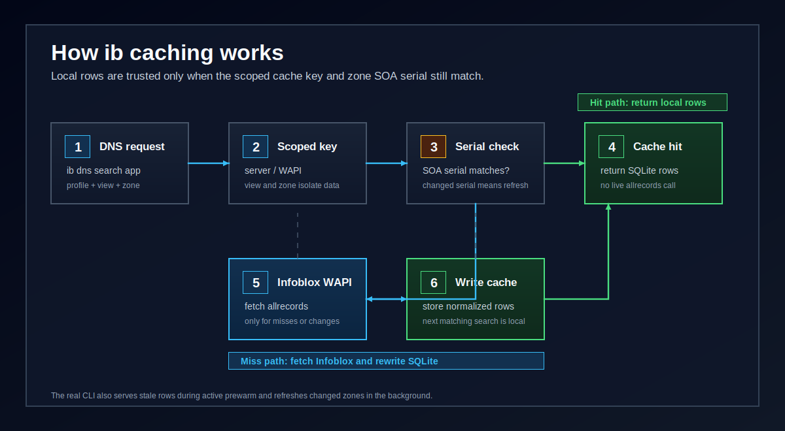
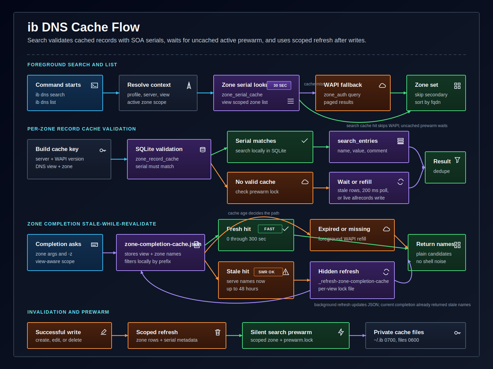
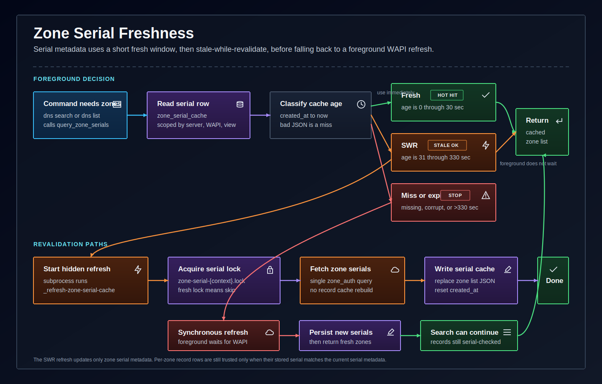

# Performance Architecture

`ib` is designed to make repeated DNS work feel fast even when Infoblox has many
authoritative zones and records. The speed comes from combining pooled WAPI
keep-alive connections, scoped caching, SOA serial validation, zone-level
parallelism, and background warming.

The important rule is: `ib` can avoid live `allrecords` calls only when it has a
safe reason to trust local data. Record data is reused when the cached zone
serial matches the active SOA serial metadata. When cache is absent while a
background prewarmer is running, search waits for that warmer, retries the cache,
and only then falls back to live WAPI. Other cold or invalid cache paths fetch
fresh data and rebuild the local SQLite rows.





## Search Performance

Search and list commands share the same serial-validated record cache so they
avoid doing one large, repeated live scan whenever possible. Search follows this
multi-zone flow:

1. Resolve the active profile, DNS view, and zone scope.
2. Read short-lived zone serial metadata.
3. Split work by authoritative zone.
4. Process multiple zones concurrently when more than one zone is in scope.
5. Borrow pooled keep-alive WAPI connections only for zones that need live data.
6. For each zone, search local SQLite if the cached serial still matches.
7. If a prewarmer owns refresh, serve stale rows immediately or wait for an
   uncached zone, polling every 200 ms until the warmer finishes.
8. Fetch live `allrecords` only for zones that still miss cache validation.
9. Sort and deduplicate records once all zone workers finish.

This keeps the common search path local: SQLite lookup, normalized exact field
matching, optional fuzzy matching, and table/JSON/CSV rendering. Live WAPI calls
are reserved for cold cache, expired serial metadata, changed zones, or explicit
cache refresh paths. `ib dns list` reads the same valid per-zone cache when it
can, but if the requested zone misses cache validation it fetches that zone live
instead of waiting on the search prewarmer.

## Parallel Zone Workers

`ib` parallelizes by zone, not by individual DNS record. A search first builds
the list of zones to inspect. If there is more than one zone, it starts a
`ThreadPoolExecutor` with this limit:

```text
min(DNS_SEARCH_WORKERS, number_of_zones)
```

`DNS_SEARCH_WORKERS` is currently `10`, so a search across 20 zones can have up to
10 zones being processed at the same time. As each worker finishes, the executor
assigns it another zone until the zone list is complete.

Each worker gets its own cloned Infoblox client. Clones share the same
thread-safe WAPI connection pool, but each request borrows a single checked-out
HTTP(S) connection while it is in flight. That avoids sharing one connection
object across threads while still allowing workers to reuse idle keep-alive
sockets for the same server, WAPI version, DNS view, timeout, and SSL settings.

Threads help here because the expensive parts are I/O-bound: waiting for WAPI,
reading SQLite, and writing refreshed cache rows. While one worker is waiting on
Infoblox, another worker can continue processing a different zone. After the
workers return their matches, the main thread sorts records and removes
duplicates so output remains stable.

Background prewarm uses the same zone-level worker model. The hidden
`ib _prewarm-search-cache` command scans either the global forward-zone set or a
scoped zone set selected by `ib dns zone use <zone>` or a successful DNS
mutation, then warms each zone cache concurrently, also capped by
`DNS_SEARCH_WORKERS`. It uses the normal zone serial stale-while-revalidate path,
so a hidden zone metadata refresh starts only when cached serial metadata is
stale enough to revalidate.

## WAPI Connection Pooling

Live Infoblox calls use a small in-process connection pool. Each
`InfobloxClient` owns a `WapiConnectionPool`; cloned clients created for search
workers share that pool. The pool size follows the search worker limit:

```text
WAPI_CONNECTION_POOL_SIZE = DNS_SEARCH_WORKERS
```

That is currently `10`, matching the maximum number of concurrent zone workers.
The pool creates HTTP or HTTPS connections lazily as requests need them, then
keeps healthy idle connections available for later WAPI calls in the same CLI
process.

Every WAPI request sends:

```text
Connection: keep-alive
```

After reading the full response body, `ib` checks whether the server still allows
the connection to be reused. If the response says `Connection: close`, or Python's
HTTP response object marks the socket as closing, the connection is discarded
instead of being returned to the pool.

Stale keep-alive sockets are handled conservatively. If a borrowed pooled socket
fails during a `GET`, `ib` closes that socket, opens or borrows another one, and
retries the `GET` once. Non-`GET` operations are not retried automatically,
because replaying record or zone mutations could duplicate a write.

## Cache Layers

| Cache | Location | Scope | Freshness rule |
| --- | --- | --- | --- |
| Zone completion names | `~/.ib/zone-completion-cache.json` | Active DNS view | 300 seconds fresh, then 48 hours stale-while-revalidate |
| Zone serial metadata | `~/.ib/allrecords-cache/cache.sqlite3` | Server, WAPI version, DNS view | 30 seconds fresh, then 300 seconds stale-while-revalidate |
| Record search entries | `~/.ib/allrecords-cache/cache.sqlite3` | Server, WAPI version, DNS view, zone | SOA serial match |
| Prewarm lock | `~/.ib/allrecords-cache/prewarm.lock` | Local machine | Stale after 600 seconds; uncached search waits and polls every 200 ms |

The cache directory is private. `ib` creates `~/.ib` and
`~/.ib/allrecords-cache` with mode `0700`, and writes cache files with mode
`0600` where the platform allows it.

Cache keys include the Infoblox server, WAPI version, DNS view, and normalized
zone name where applicable. That prevents cached data from crossing profiles,
views, or zones.

## Serial Freshness



Zone serial metadata is fresh for 30 seconds. During that fresh window, `ib`
avoids querying the full zone list again.

From 31 through 330 seconds, the serial list enters stale-while-revalidate.
Foreground commands keep using the cached serial list immediately and start a
hidden zone metadata refresh:

```text
ib _refresh-zone-serial-cache
```

That hidden refresh first fetches zone serial metadata. When it detects changed
SOA serials for authoritative zones, it acquires `prewarm.lock` before publishing
the newer serial metadata, then refreshes only those changed zones' record caches
in the same background process. While that refresh lock is active, new foreground
zone serial reads keep serving the existing cached zone list immediately, even if
that cache has just passed the normal stale-while-revalidate max age.

If the serial cache is missing, corrupt, or older than 330 seconds, `ib` refreshes
serial metadata synchronously before continuing. The exception is when a hidden
serial refresh lock is already active: then foreground reads return the expired
cached zone list immediately and let the active refresh publish the replacement.
This prevents duplicate foreground WAPI calls while still avoiding very old
serial state when no refresh is already in progress.

## Record Cache Validation

Record cache rows are stored as normalized search entries:

- record type
- zone
- display name
- searchable value
- comment
- original record JSON

Search uses the normalized `name`, `value`, and `comment` fields. By default it
checks exact substring matches. When the user passes `-f`, search also checks
typo-tolerant fuzzy matches. The original record JSON remains available so
table, JSON, and CSV output can use the same rendering path as live WAPI
results.
For PTR records, the searchable value includes both the target hostname and IP
address so `ib dns search -g <ip-address>` can find reverse records while output
still displays the PTR target hostname.

For a zone, cached records are trusted only when the stored `zone_record_cache`
serial matches the current serial metadata for that zone. If the serial matches,
`ib` searches local SQLite regardless of row age; `updated_at` is diagnostic
metadata, not an expiry field. Background prewarm updates `updated_at` after it
validates a matching serial so operators can see when the cache was last warmed.
If the serial differs, is missing, or cannot be read, `ib` fetches fresh
`allrecords` with WAPI paging, normalizes the records, and replaces that zone's
cached rows.

When `prewarm.lock` shows a live background warmer, search avoids racing the
warmer. If a zone has older cache metadata, search serves those stale SQLite rows
immediately. If the zone has no cache metadata yet, search waits for the lock to
clear, polling every 200 ms, then retries the cache. Only if the cache is still
missing after the warmer completes does search fetch live `allrecords` itself.

## Completion Performance

Zone-name completion uses the small JSON cache and filters zone names locally by
the typed prefix. Names are fresh for 300 seconds. After that, completion still
returns the cached names for up to 48 hours and starts the hidden
`ib _refresh-zone-completion-cache` command to refill the JSON cache in the
background. If the JSON file is missing, corrupt, scoped to a different DNS
view, or older than the 48-hour stale window, completion refreshes synchronously
when possible. If completion cannot read config, connect to Infoblox, parse the
cache, or write the cache, it returns no candidates instead of printing errors
into the shell.

Record-name completion for `ib dns delete` and `ib dns edit` uses the DNS search
cache. It can suggest records outside the active zone because it searches the
global forward-zone cache and filters out reverse or unsupported record types
that should not be completed in normal forward delete and edit flows.

## Invalidation And Prewarm

Successful DNS mutations call the shared cache refresh path. That includes:

- record create
- record edit
- record delete
- zone create
- zone delete

When the changed zone is known, the refresh path removes only that zone's record
search rows, removes the current server/view zone serial metadata, and starts a
detached prewarm scoped to that zone and child authoritative zones. That is the
normal path for record create, record edit, record delete, zone create, and zone
delete. If a mutation cannot identify a zone, the fallback path still clears the
whole DNS search cache and starts global prewarm.

Zone completion has its own JSON cache and refresh path. It can serve stale names
for up to 48 hours after its 300-second fresh window while a hidden refresh
updates the JSON file. `ib dns zone use <zone>` does not clear caches, but it
starts detached prewarm scoped to the selected zone and its child authoritative
zones.

The prewarmer uses `prewarm.lock` to avoid duplicate warmers. If another
prewarmer is already running, the new one exits. If the lock is older than 600
seconds, it is considered stale and can be replaced. Foreground commands also use
that non-stale lock as the signal to avoid duplicate live allrecords refreshes.

## Failure Behavior

Cache failures are treated as performance misses, not command failures. If a
cache file is missing, corrupt, locked, expired, or not writable, `ib` falls back
to live WAPI queries when the foreground command needs data.

The main exception is shell completion: completion is intentionally best-effort.
If completion cannot safely use cached data or fetch fresh data, it returns an
empty candidate list so the shell remains clean.

## Operational Notes

- The SQLite cache is the current cache format.
- Older legacy JSON allrecords cache files are still readable and are migrated
  into SQLite when they match the current SOA serial.
- Secondary zones are skipped during global search and warmup.
- Cold searches and background warmup process multiple zones concurrently, up to
  the configured worker limit.
- Foreground commands can use zone serial metadata for up to 300
  stale-while-revalidate seconds after the 30-second fresh window; background
  prewarm follows the same rule instead of forcing a metadata refresh.
